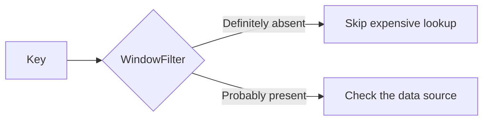

# WindowFilter

WindowFilter is a dependency-free Rust library that checks whether a key was probably seen
before without storing the full key. It can quickly reject missing keys before an expensive
database, disk, or network lookup.



The project implements three filters from scratch and benchmarks their memory, accuracy,
lookup speed, insertion speed, and maximum load.

## Implementations

- `BloomFilter`: simple and compact, but cannot delete individual keys.
- `CuckooFilter`: uses two four-slot buckets and supports deletion.
- `WindowedCuckooFilter`: uses overlapping two-slot windows to save memory while
  supporting deletion.

The windowed design follows [*Smaller and More Flexible Cuckoo
Filters*](https://arxiv.org/abs/2505.05847). Each entry contains a `k`-bit fingerprint,
a window-choice bit, and a position bit. Signed offsets allow any number of windows, and
bit packing prevents unused padding between entries.

## Usage

```rust
use windowfilter::WindowedCuckooFilter;

let mut filter = WindowedCuckooFilter::new(100_000, 10);

assert!(filter.insert("evan"));
assert!(filter.contains("evan"));
assert!(!filter.contains("bob")); // probabilistic: false positives are possible
assert!(filter.delete("evan"));
assert!(!filter.contains("evan"));
```

The second constructor argument is `k`, giving a target false-positive rate of `2^-k`.
`insert` returns `false` if a cuckoo filter reaches its relocation limit. Failed inserts
are rolled back, preserving every key already in the filter.

Bloom filters cannot safely delete individual keys because their bits are shared. The two
cuckoo filters support deletion, but, as with cuckoo filters generally, call `delete` only
for keys known to have been inserted. Deleting a false-positive key can remove a colliding
fingerprint.

## Benchmark

```text
filter                     bytes/item false-positive    lookup ns    insert ns     max load
Bloom                          1.8034       0.001015        81.59        93.61    unbounded
Cuckoo (2,4)                   2.1299       0.000820        61.19        58.74       0.9780
Windowed cuckoo (2,2)          1.5958       0.000955        60.28       162.97       0.9575
```

The windowed cuckoo filter used the least memory at 1.5958 bytes per item. That is about
12% less memory than the Bloom filter and 25% less than the conventional cuckoo filter.
Its 60.28-nanosecond lookup time was also the fastest result in this run.

The memory savings come with slower writes. A windowed insertion took 162.97 nanoseconds,
compared with 58.74 nanoseconds for the conventional cuckoo filter. Moving fingerprints
through overlapping windows requires more work when slots are occupied.

All three false-positive rates were close to the `2^-10` target of about 0.000977, or one
false positive per 1,024 absent keys. Small differences between the three measurements
are expected when testing a finite number of queries.

The conventional cuckoo filter reached the highest load at 97.80% and had the fastest
insertions, but used the most memory because its bucket count must be a power of two. The
windowed filter reached 95.75% while allocating memory more closely to the requested size.
The Bloom filter has no fixed maximum load, but it does not support deletion.

## Design notes

The Bloom filter uses Kirsch-Mitzenmacher double hashing and the optimal number of hash
probes for its allocated bit count. The conventional cuckoo filter stores `k + 3`-bit
fingerprints across eight candidate slots. The windowed filter stores `k + 2` bits across
four candidate slots and targets a practical load of 94%.

The implementation uses a deterministic, non-cryptographic 64-bit hash. It is suitable
for experiments and trusted inputs, not adversarial settings. This crate intentionally
uses no external Rust packages so the layouts and benchmark are easy to inspect.

## Reference

Johanna Elena Schmitz, Jens Zentgraf, and Sven Rahmann. [*Smaller and More Flexible Cuckoo
Filters*](https://arxiv.org/abs/2505.05847), arXiv:2505.05847.

## License

MIT
